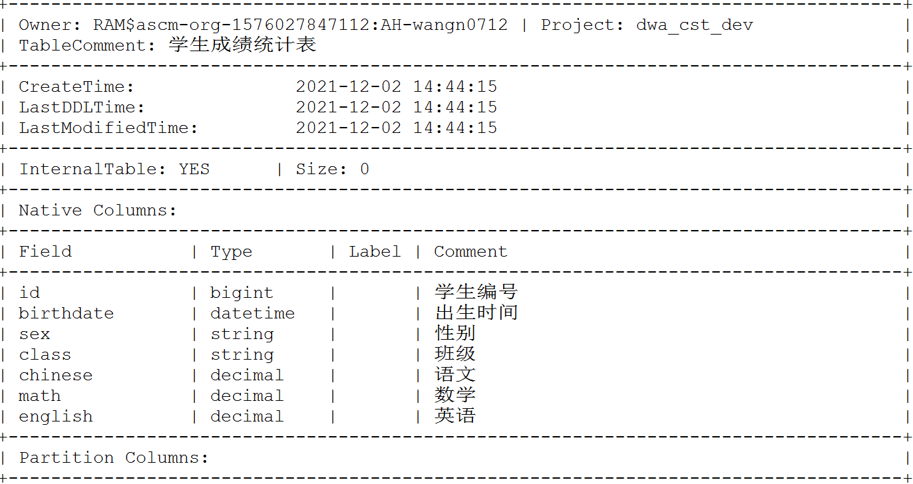
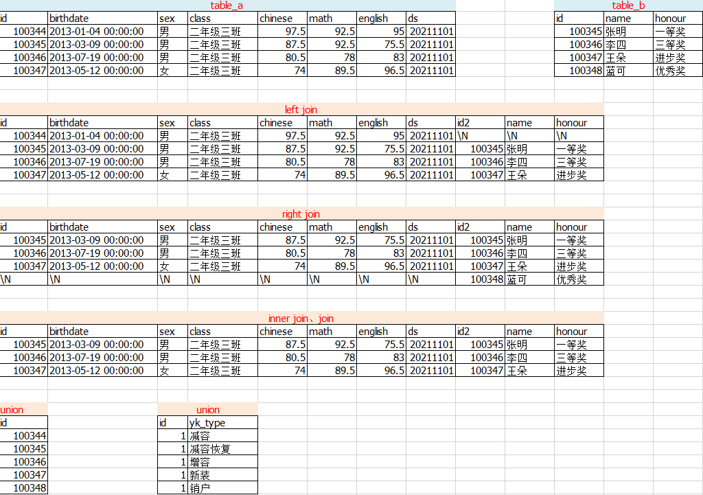

# odps_sql_Note
记录自己之前常用到的odps_sql函数，防止遗忘
注：本文是odps_sql，与mysql语法有些许差异

## 一、建表函数

### 1.1 create table

功能：建表
```sql
CREATE TABLE IF NOT EXISTS table_a
(
    id  BIGINT  COMMENT '学生编号',
    birthdate  DATETIME COMMENT '出生时间',
    sex  STRING COMMENT '性别',
    class  STRING COMMENT '班级',
    chinese DECIMAL COMMENT '语文',
    math  DECIMAL COMMENT '数学',
    english  DECIMAL COMMENT '英语'
)
COMMENT '学生成绩统计表'
PARTITIONED BY  -- 分区，非必需
(	ds STRING
) ;
```

### 1.2 drop table

功能：删表

```sql
DROP TABLE IF EXISTS table_a ;
```

### 1.3 desc

功能：查看表结构
```sql
DESC table_a ;
```



## 二、数据插入

### 2.1 insert into/overwrite

功能：插入数据

INSERT OVERWRITE 是插入数据前删除原有数据，即重写；

INSERT INTO 是插入数据到原表，即追加

```sql
-- 1、插入单条记录
INSERT OVERWRITE/INTO TABLE table_a PARTITION (ds='${bdp.system.bizdate}')
VALUES (100345,'2013-03-09 00:00:00','男','二年级三班','87.5','98.0','76.5') ;

-- 2、插入多条记录
INSERT OVERWRITE/INTO TABLE table_a PARTITION (ds='${bdp.system.bizdate}')
VALUES (100346,'2013-07-03 00:00:00','男','二年级三班','80.5','92.0','86.0'),
		(100347,'2013-05-15 00:00:00','女','二年级三班','83.0','66.0','90.5'),
		(100348,'2013-06-08 00:00:00','男','二年级三班','78.5','82.5','83.0') ;
		
-- 3、插入查询结果
INSERT OVERWRITE/INTO TABLE table_a PARTITION (ds='${bdp.system.bizdate}')
SELECT * FROM table_z ; --查询生成的数据需要和table_a结构相同
```

## 三、拼接函数

### 3.1 inner/left/right join ... on、union

功能：两表或多表拼接（横向）

```sql
-- inner/left/right join ... on 两表或多表拼接（横向）
SELECT * FROM table_a a
LEFT/RIGHT/INNER JOIN table_b b
ON a.id = b.id ;

-- union 两表或多表拼接（纵向） 
--1、两表上下合并
SELECT a.id FROM table_a
UNION
SELECT b.id FROM table_b ;

--2、新建表
SELECT '1' as id, x.yk_type FROM (
	SELECT '新装' AS yk_type
	UNION
	SELECT '增容' AS yk_type
	UNION
	SELECT '减容' AS yk_type
	UNION
	SELECT '销户' AS yk_type
	UNION
	SELECT '减容恢复' AS yk_type ) x ;
```



## 四、统计函数

### 4.1 max、min、abs、avg、sum、count、round

功能：最大值、最小值、绝对值、平均值、求和、计数、取小数

```sql
-- 1、最大值、最小值、平均值
SELECT MAX(math) AS max_mat ,MIN(english) AS min_eng ,AVG(chinese) AS avg_chi
FROM table_a ;

-- 2、求和，均值
SELECT sex, SUM(math), AVG(math) from table_a GROUP BY sex ;

-- 3、计数
SELECT COUNT(1) FROM table_a ;
SELECT honour,COUNT(1) FROM table_b GROUP BY honour ;

-- 4、取一位小数
SELECT round(chinese,1) from table_a ;
```

## 五、窗口函数

### 4.1 ... over  (partition by ... order by ...) ...

功能：分组排序、算均值之类

```sql
-- 1、row_number() over (partition by ... order by ...)
-- 按照性别分组，由chinese降序排列，排序号为rn
SELECT a.*, 
ROW_NUMBER() over (PARTITION BY sex 
                    ORDER BY chinese DESC) rn
FROM table_a a;

-- 2、近半年均值
SELECT *, 
AVG(cnlyl) over (PARTITION BY pucnumber,
                consid ORDER BY pucnumber,
                consid,
                yearmon rows between 6 preceding and 0 preceding) as F 
FROM table_x ;

-- 3、历史连续6个月月均产能利用率，1-6月，2-7月，3-8月...
SELECT *, 
AVG(cnlyl) over (PARTITION BY pucnumber,
                consid ORDER BY pucnumber,
                consid,
                yearmon rows between 12 preceding and 6 preceding) as F 
FROM table_x ;
```

## 六、日期函数

### 6.1 to_date

功能：日期转换标准格式

```sql
SELECT TO_DATE('2019-03-23 00:00:00') ;
-- 2019-03-23

SELECT TO_DATE('20190323', 'yyyymmdd') ;
-- 2019-03-23 00:00:00

SELECT TO_DATE('201903', 'yyyymm') ;
-- 2019-03-01 00:00:00
```

### 6.2 dateadd

功能：日期增减

```sql
SELECT DATEADD('2020-03-21 00:00:00',-1,'yyyy') ;
-- 2019-03-21 00:00:00

SELECT DATEADD('2020-03-21 00:00:00',1,'mm') ;
-- 2020-04-21 00:00:00

SELECT DATEADD('2020-03-21 00:00:00',15,'dd') ;
-- 2020-04-05 00:00:00
```

### 6.3 datediff

功能：计算日期差值

```sql
SELECT DATEDIFF(to_date('20210213','yyyymmdd'),
                to_date('20211002','yyyymmdd'),
                'dd') ;
-- -231

SELECT DATEDIFF(to_date('202102','yyyymm'),
                to_date('202110','yyyymm'),
                'mm') ;
-- -8
```

### 6.4 getdate()

功能：获取当前日期

```sql
-- 获取当前时间
SELECT getdate() ;
-- 2021-12-02 16:02:54
```

### 6.5 max_pt

功能：取最大分区数据

```sql
-- 取最大分区数据
SELECT * 
FROM table_a 
WHERE ds=MAX_PT('table_a') ;
```

## 七、参数

功能：设置变量

```sql
-- 取20200101和【选取的运行日期往后推key1个月】相比较大的那个值
SELECT GREATEST('2020-01-01 00:00:00', 
                DATEADD(TO_DATE('${bdp.system.bizdate}','yyyymmdd'),${key1},'mm'));
-- key取-1,${bdp.system.bizdate}取20211101
-- 2021-10-01 00:00:00
```

## 八、其它函数

### 8.1 substr

功能：节选字符

```sql
SELECT substr('2019-03-14 00:00:00',1,10);
-- 2019-03-14
```

### 8.2 concat

功能：字符连接

```sql
SELECT CONCAT('安徽省','合肥市');
-- 安徽省合肥市
```

### 8.3 to_char

功能：其它类型转换成字符型

```sql
SELECT to_char(120) ;

SELECT to_char(id) as id_new FROM table_a ;
```

### 8.4 regexp_replace

功能：替换

```sql
-- 字符替换
SELECT REGEXP_REPLACE('2020-01-01','-','') ;
-- 20210101
```

### 8.4 greatest

功能：求最大值

```sql
-- 1、比较2个数值
SELECT GREATEST(10,19);
-- 19

-- 2、比较2个时间
SELECT GREATEST('2020-01-01 00:00:00', '2021-02-05 00:00:00');
-- 2021-02-05 00:00:00

-- 3、比较同行几列值大小
-- 取同一id，语数外分数最高的分数
SELECT id,greatest(chinese,math,english) from table_a ;

-- 取20200101和【选取的运行日期往后推key1个月】相比较大的那个值
SELECT GREATEST('2020-01-01 00:00:00', 
                DATEADD(TO_DATE('${bdp.system.bizdate}','yyyymmdd'),${key1},'mm'));
-- key取-1,${bdp.system.bizdate}取20211101
-- 2021-10-01 00:00:00
```

### 8.5 rand

功能：随机生成[0,1)之间的实数

```sql
SELECT rand()*10 + 50 ;
-- 50.0047147...
```

### 8.6 int

功能：取整

```sql
SELECT int(rand()*10 + 50) ;
-- 50
```


### 8.7 distinct

功能：去重

```sql
SELECT distinct id from table_a;
```


### 8.8 in

功能：判断在...中

```sql
SELECT  * 
from table_a 
where id not in (select id from table_b);
```

### 8.9 like

功能：模糊查询

```sql
-- id 以002结尾的数据
SELECT  * 
from table_a 
where id like '%002';
```

### 8.10 case when

功能：条件

```sql
SELECT  *,case when (chinese+math+english)>=270 then '优'
                when (chinese+math+english)>=240 and (chinese+math+english)<270 then '良' 
			    else '中' end as grade 
FROM table_a ;
```
